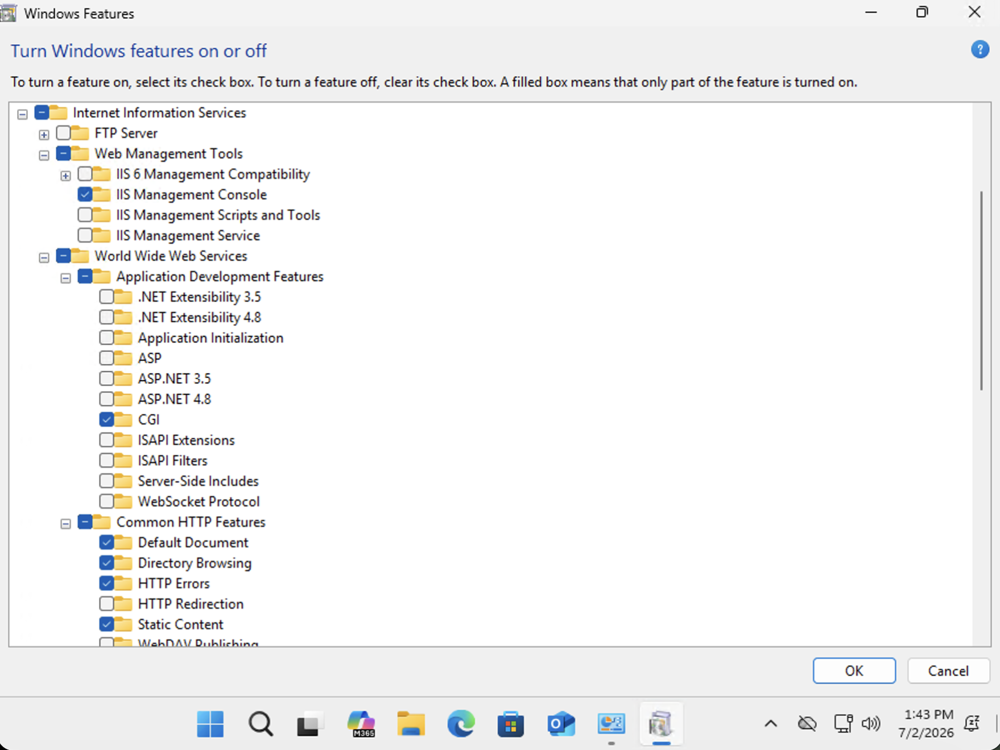
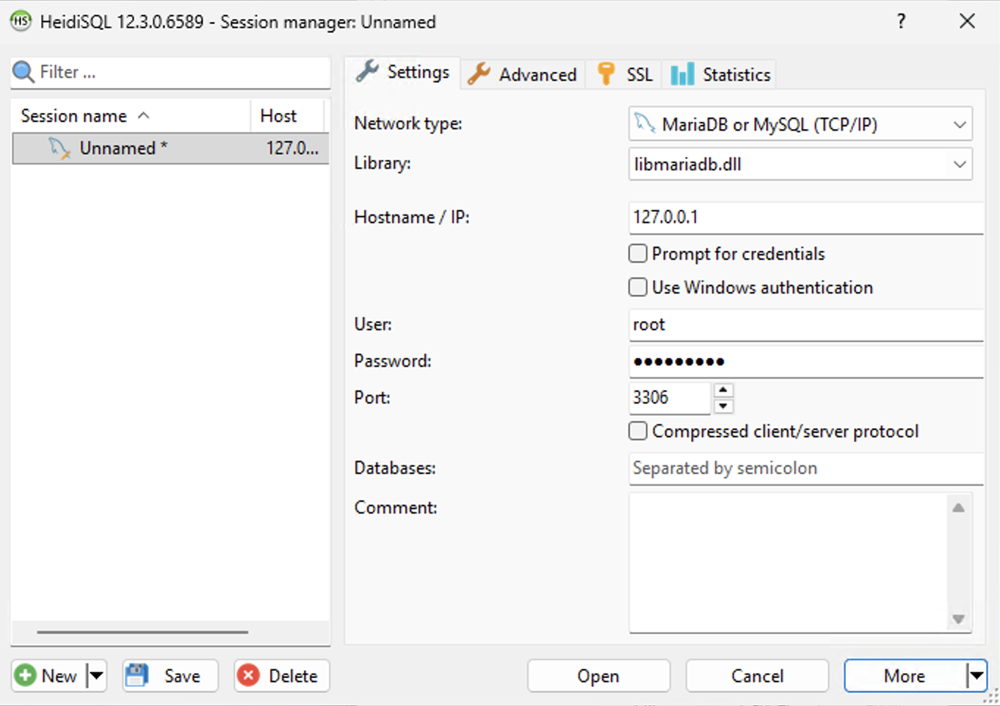
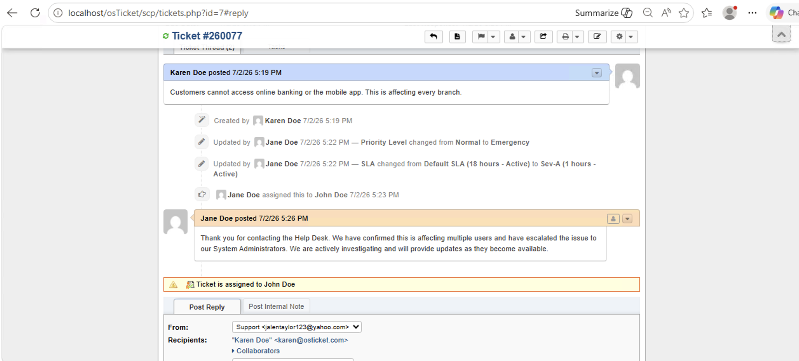

<h1 align="center">🎫 osTicket Help Desk Deployment on Microsoft Azure</h1>

  A hands-on IT support and systems administration lab focused on deploying, configuring, and testing osTicket in a Microsoft Azure environment.

  
  
  
  
  
  

  <a href="#-project-overview">Overview</a> •
  <a href="#-lab-environment">Lab Environment</a> •
  <a href="#-installation-walkthrough">Installation</a> •
  <a href="#-post-installation-configuration">Configuration</a> •
  <a href="#-ticket-lifecycle-demonstration">Ticket Lifecycle</a> •
  <a href="#-troubleshooting">Troubleshooting</a> •
  <a href="#-skills-demonstrated">Skills</a>

<h2>📌 Project Overview</h2>

This project documents the deployment of <b>osTicket</b>, an open-source help desk ticketing system, inside a Microsoft Azure virtual machine. The lab simulates a real IT support environment by installing and configuring IIS, PHP, MySQL, HeidiSQL, and osTicket, then validating the platform through agent creation, department configuration, SLA setup, user ticket submission, ticket assignment, escalation, response, and resolution.

The purpose of this lab was to strengthen hands-on experience with cloud-hosted Windows environments, web application deployment, database configuration, permissions management, and help desk ticket workflows.

<h2>🎯 Objectives</h2>

<ul>
  <li>Create a Microsoft Azure resource group</li>
  <li>Deploy and configure a Windows virtual machine</li>
  <li>Connect to the VM using Remote Desktop Protocol</li>
  <li>Install and configure Internet Information Services</li>
  <li>Install PHP and configure PHP Manager for IIS</li>
  <li>Install and configure MySQL Server</li>
  <li>Use HeidiSQL to create the osTicket database</li>
  <li>Deploy osTicket files to the IIS web root</li>
  <li>Adjust file permissions required for installation</li>
  <li>Complete the osTicket browser-based installer</li>
  <li>Configure agents, roles, departments, teams, SLAs, and help topics</li>
  <li>Create, triage, assign, escalate, respond to, and resolve tickets</li>
  <li>Delete Azure resources after the lab to prevent unnecessary charges</li>
</ul>

<h2>🧰 Technologies Used</h2>

<ul>
  <li>Microsoft Azure</li>
  <li>Windows 11 Virtual Machine</li>
  <li>Remote Desktop Protocol</li>
  <li>Internet Information Services</li>
  <li>PHP</li>
  <li>PHP Manager for IIS</li>
  <li>MySQL Server 5.5</li>
  <li>HeidiSQL</li>
  <li>osTicket v1.15.8</li>
  <li>Microsoft Edge</li>
</ul>

<h2>🧠 Skills Demonstrated</h2>

<ul>
  <li>Cloud resource deployment</li>
  <li>Virtual machine provisioning</li>
  <li>Windows system administration</li>
  <li>IIS web server configuration</li>
  <li>PHP runtime configuration</li>
  <li>MySQL database setup</li>
  <li>Database creation using HeidiSQL</li>
  <li>Web application deployment</li>
  <li>NTFS permission configuration</li>
  <li>Help desk ticketing system administration</li>
  <li>SLA and priority management</li>
  <li>Ticket triage, escalation, and resolution</li>
  <li>Technical documentation</li>
  <li>Cloud resource cleanup</li>
</ul>

<h2>🖥️ Lab Environment</h2>

<table>
  <tr>
    <th>Component</th>
    <th>Configuration</th>
  </tr>
  <tr>
    <td>Cloud Provider</td>
    <td>Microsoft Azure</td>
  </tr>
  <tr>
    <td>Resource Group</td>
    <td>rg-osticket-lab</td>
  </tr>
  <tr>
    <td>Virtual Machine</td>
    <td>Vm-osticket</td>
  </tr>
  <tr>
    <td>Operating System</td>
    <td>Windows 11 Pro</td>
  </tr>
  <tr>
    <td>VM Size</td>
    <td>Standard D2s v3, 2 vCPUs, 8 GiB RAM</td>
  </tr>
  <tr>
    <td>Web Server</td>
    <td>IIS</td>
  </tr>
  <tr>
    <td>Database</td>
    <td>MySQL</td>
  </tr>
  <tr>
    <td>Database Tool</td>
    <td>HeidiSQL</td>
  </tr>
  <tr>
    <td>Application</td>
    <td>osTicket</td>
  </tr>
  <tr>
    <td>Access Method</td>
    <td>Remote Desktop Protocol</td>
  </tr>
</table>

<h2>🏗️ Deployment Workflow</h2>

<pre>
Microsoft Azure
   │
   ▼
Resource Group
   │
   ▼
Windows Virtual Machine
   │
   ▼
Remote Desktop Connection
   │
   ▼
IIS Installation
   │
   ▼
PHP + PHP Manager Configuration
   │
   ▼
MySQL Server Installation
   │
   ▼
HeidiSQL Database Creation
   │
   ▼
osTicket File Deployment
   │
   ▼
NTFS Permission Configuration
   │
   ▼
osTicket Web Installer
   │
   ▼
Admin, Agent, SLA, and Ticket Configuration
</pre>

<h2>📸 Installation Walkthrough</h2>

<h3>Step 1: Create the Azure Resource Group</h3>

A resource group was created in Microsoft Azure to organize all lab resources under one container.

<ul>
  <li>Created the resource group <b>rg-osticket-lab</b></li>
  <li>Selected the Central US region</li>
  <li>Used the resource group to contain the VM, public IP, NIC, NSG, and virtual network</li>
</ul>

<h3>Step 2: Create the Azure Virtual Machine</h3>

A Windows virtual machine was deployed in Azure to host the osTicket help desk environment.

<ul>
  <li>Created a VM named <b>Vm-osticket</b></li>
  <li>Selected a Windows 11 Pro image</li>
  <li>Configured the VM size as Standard D2s v3</li>
  <li>Allowed RDP as the inbound access method</li>
  <li>Created a virtual network, subnet, public IP address, and network security group</li>
</ul>

<h3>Step 3: Validate and Deploy the VM</h3>

Azure validation passed before deployment, confirming that the selected VM configuration was ready to deploy.

<ul>
  <li>Reviewed configuration before deployment</li>
  <li>Validated settings</li>
  <li>Deployed the virtual machine and supporting network resources</li>
</ul>

<h3>Step 4: Review the Running VM</h3>

After deployment, the VM was confirmed to be running and accessible from the Azure portal.

<ul>
  <li>Verified VM status was running</li>
  <li>Reviewed the public IP address</li>
  <li>Confirmed VM size, operating system, private IP address, and virtual network</li>
</ul>

<h3>Step 5: Install IIS</h3>

Internet Information Services was enabled so the VM could act as a web server for osTicket.

<ul>
  <li>Enabled Internet Information Services</li>
  <li>Enabled CGI for PHP support</li>
  <li>Enabled IIS Management Console</li>
  <li>Confirmed IIS Manager loaded successfully</li>
</ul>

<h3>Step 6: Extract and Configure PHP</h3>

PHP was extracted to the local system so IIS could process PHP files required by osTicket.

<ul>
  <li>Extracted PHP files to <b>C:\PHP</b></li>
  <li>Verified PHP folder contents</li>
  <li>Prepared PHP for IIS integration</li>
</ul>

<h3>Step 7: Install PHP Manager for IIS</h3>

PHP Manager was installed to simplify PHP registration and configuration inside IIS.

<ul>
  <li>Installed PHP Manager for IIS</li>
  <li>Registered the PHP executable path</li>
  <li>Used <b>C:\PHP\php-cgi.exe</b> as the PHP executable</li>
  <li>Confirmed PHP Manager appeared in IIS Manager</li>
</ul>

<h3>Step 8: Install MySQL Server</h3>

MySQL Server was installed to provide the database backend for osTicket.

<ul>
  <li>Installed MySQL Server 5.5</li>
  <li>Selected the Typical setup option</li>
  <li>Used the standard configuration option</li>
  <li>Prepared MySQL for local database hosting</li>
</ul>

<h3>Step 9: Configure MySQL Root Credentials</h3>

The MySQL root password was configured during setup, and the MySQL service was started successfully.

<ul>
  <li>Configured the MySQL root password</li>
  <li>Started the MySQL service</li>
  <li>Applied security settings</li>
  <li>Confirmed configuration completed successfully</li>
</ul>

<h3>Step 10: Connect to MySQL with HeidiSQL</h3>

HeidiSQL was used to connect to the local MySQL instance and manage the osTicket database.

<ul>
  <li>Connected to MySQL using <b>127.0.0.1</b></li>
  <li>Used the root account</li>
  <li>Connected over port <b>3306</b></li>
</ul>

<h3>Step 11: Create the osTicket Database</h3>

A new database was created for osTicket using HeidiSQL.

<ul>
  <li>Created a new database named <b>osticket</b></li>
  <li>Verified the database appeared in HeidiSQL</li>
  <li>Prepared the database for the osTicket installer</li>
</ul>

<h3>Step 12: Extract and Deploy osTicket Files</h3>

The osTicket installation files were extracted and the upload folder was copied into the IIS web root.

<ul>
  <li>Extracted osTicket v1.15.8</li>
  <li>Copied the <b>upload</b> folder</li>
  <li>Moved the folder into <b>C:\inetpub\wwwroot</b></li>
  <li>Renamed the folder to <b>osTicket</b></li>
  <li>Verified osTicket files were present in the web directory</li>
</ul>

<h3>Step 13: Configure File Permissions</h3>

File permissions were adjusted so osTicket could write to the configuration file during installation.

<ul>
  <li>Adjusted inherited permissions</li>
  <li>Converted inherited permissions into explicit permissions</li>
  <li>Granted temporary write access to the configuration file</li>
  <li>Prepared the system for the browser-based installation</li>
</ul>

<h3>Step 14: Run the osTicket Installer</h3>

The osTicket installer was launched from the browser and verified that the required prerequisites were available.

<ul>
  <li>Opened the osTicket installer from the browser</li>
  <li>Verified PHP and MySQL requirements</li>
  <li>Connected osTicket to the MySQL database</li>
  <li>Completed the installation successfully</li>
</ul>

<h3>Step 15: Log Into osTicket</h3>

After installation, the staff control panel login page was used to access the osTicket environment.

<ul>
  <li>Accessed the osTicket staff login page</li>
  <li>Logged in as an administrator</li>
  <li>Verified the dashboard loaded successfully</li>
</ul>

<h2>⚙️ Post-Installation Configuration</h2>

<h3>Step 16: Configure Agents</h3>

Agents were created to simulate support staff working inside the help desk environment.

<ul>
  <li>Created multiple agents</li>
  <li>Verified agent status was active</li>
  <li>Assigned agents to the Support department</li>
</ul>

<h3>Step 17: Configure Roles</h3>

Roles were configured to control agent permissions and administrative capabilities.

<ul>
  <li>Created a custom role</li>
  <li>Configured role permissions</li>
  <li>Used roles to define agent access levels</li>
</ul>

<h3>Step 18: Configure Departments</h3>

Departments were configured to organize support responsibilities across different functional areas.

<ul>
  <li>Created Maintenance, Support, and System Administrators departments</li>
  <li>Verified departments were active</li>
  <li>Assigned department email information</li>
</ul>

<h3>Step 19: Configure Teams</h3>

Teams were created to simulate tiered support escalation groups.

<ul>
  <li>Created Level I Support</li>
  <li>Created Level II Support</li>
  <li>Prepared team structure for ticket escalation</li>
</ul>

<h3>Step 20: Configure SLA Plans</h3>

Service Level Agreements were created to define response expectations based on issue severity.

<ul>
  <li>Reviewed the Default SLA</li>
  <li>Created Sev-A, Sev-B, and Sev-C SLA plans</li>
  <li>Used SLA plans to support priority-based ticket handling</li>
</ul>

<h3>Step 21: Configure Help Topics</h3>

Help topics were configured to categorize support requests and route issues to the correct department.

<ul>
  <li>Configured Business Critical Outage</li>
  <li>Configured Equipment Request</li>
  <li>Configured Password Reset</li>
  <li>Configured Report a Problem and Access Issue topics</li>
  <li>Associated help topics with support departments and priorities</li>
</ul>

<h3>Step 22: Verify End Users</h3>

End users were created to simulate customers submitting support tickets.

<ul>
  <li>Created sample users</li>
  <li>Verified users appeared in the user directory</li>
  <li>Prepared users for ticket submission testing</li>
</ul>

<h2>🎟️ Ticket Lifecycle Demonstration</h2>

<h3>Step 23: Access the End-User Support Center</h3>

The end-user support portal was tested to verify that users could submit support requests.

<ul>
  <li>Opened the public support center</li>
  <li>Verified the Open a New Ticket option was available</li>
  <li>Verified the Check Ticket Status option was available</li>
</ul>

<h3>Step 24: Create a Support Ticket</h3>

A sample support ticket was submitted to simulate a real user issue.

<ul>
  <li>Submitted a ticket from the end-user portal</li>
  <li>Confirmed the ticket request was created successfully</li>
  <li>Validated the user-facing ticket submission workflow</li>
</ul>

<h3>Step 25: Review Open Tickets</h3>

The ticket queue was reviewed from the agent interface to confirm newly created tickets appeared for support staff.

<ul>
  <li>Reviewed open tickets</li>
  <li>Verified ticket subjects, users, and priorities</li>
  <li>Confirmed the emergency ticket appeared in the queue</li>
</ul>

<h3>Step 26: Triage and Escalate a Ticket</h3>

A business-critical outage ticket was triaged by updating the priority, assigning an SLA, and routing the issue to the appropriate support personnel.

<ul>
  <li>Changed priority from Normal to Emergency</li>
  <li>Changed SLA from Default SLA to Sev-A</li>
  <li>Assigned the ticket to a support agent</li>
  <li>Documented ticket updates in the thread</li>
</ul>

<h3>Step 27: Respond to the User</h3>

A response was posted to the customer confirming that the issue had been escalated and was under investigation.

<ul>
  <li>Posted a customer-facing response</li>
  <li>Confirmed the issue was affecting multiple users</li>
  <li>Escalated the outage to System Administrators</li>
  <li>Documented investigation progress</li>
</ul>

<h3>Step 28: Add Internal Notes and Resolve the Ticket</h3>

Internal notes were added to document backend troubleshooting activity, and the ticket was resolved after service restoration.

<ul>
  <li>Added internal documentation to the ticket thread</li>
  <li>Recorded escalation and restoration details</li>
  <li>Closed the ticket with a resolution update</li>
  <li>Confirmed the full ticket lifecycle from creation to resolution</li>
</ul>

<h2>🔧 Troubleshooting</h2>

<table>
  <tr>
    <th>Issue</th>
    <th>Likely Cause</th>
    <th>Resolution</th>
  </tr>
  <tr>
    <td>IIS could not process PHP files</td>
    <td>PHP was not registered with IIS</td>
    <td>Installed PHP Manager and registered <b>C:\PHP\php-cgi.exe</b>.</td>
  </tr>
  <tr>
    <td>osTicket installer reported missing prerequisites</td>
    <td>Required PHP extensions were disabled</td>
    <td>Enabled the necessary PHP extensions and refreshed the installer.</td>
  </tr>
  <tr>
    <td>Database connection could not be completed</td>
    <td>The osTicket database had not been created yet</td>
    <td>Used HeidiSQL to create the <b>osticket</b> database.</td>
  </tr>
  <tr>
    <td>Configuration file permission warning appeared</td>
    <td>osTicket needed temporary write access to <b>ost-config.php</b></td>
    <td>Adjusted NTFS permissions and later secured the file after installation.</td>
  </tr>
  <tr>
    <td>Application files were not detected correctly</td>
    <td>osTicket files were not in the IIS web root</td>
    <td>Moved the osTicket upload folder to <b>C:\inetpub\wwwroot\osTicket</b>.</td>
  </tr>
  <tr>
    <td>Azure resources continued running after the lab</td>
    <td>The VM and dependent resources were still deployed</td>
    <td>Deleted the full resource group to remove all lab resources.</td>
  </tr>
</table>

<h2>🧠 IT Concepts Demonstrated</h2>

<ul>
  <li>Infrastructure as a Service</li>
  <li>Cloud-hosted virtual machines</li>
  <li>Remote administration</li>
  <li>Web server deployment</li>
  <li>Server-side scripting support with PHP</li>
  <li>Relational database creation</li>
  <li>Application dependency configuration</li>
  <li>NTFS permission management</li>
  <li>Role-based access concepts</li>
  <li>Help desk ticket routing</li>
  <li>Service Level Agreement management</li>
  <li>Incident prioritization and escalation</li>
  <li>End-user support workflows</li>
  <li>Cloud resource lifecycle management</li>
</ul>

<h2>📚 Lessons Learned</h2>

This lab reinforced how a production-style help desk system depends on multiple infrastructure layers working together. Azure provided the compute environment, IIS served the web application, PHP processed the application logic, MySQL stored ticketing data, and osTicket provided the front-end support workflow.

The project also strengthened my understanding of how help desk platforms support real IT operations, including ticket intake, prioritization, assignment, escalation, SLA tracking, internal documentation, user communication, and resolution.

<h2>✅ Final Result</h2>

The final result was a working osTicket help desk environment hosted on a Microsoft Azure virtual machine. The environment supported administrator access, agent access, end-user ticket submission, SLA configuration, department management, ticket assignment, internal notes, customer responses, and ticket resolution.

<h2>🧹 Resource Cleanup</h2>

After completing the lab, the Azure resource group was deleted to remove all dependent resources and prevent unnecessary cloud charges.

<ul>
  <li>Deleted the resource group <b>rg-osticket-lab</b></li>
  <li>Removed the VM, public IP, NIC, virtual network, and network security group</li>
  <li>Confirmed cleanup of cloud resources</li>
</ul>

<h2>🚀 Future Improvements</h2>

<ul>
  <li>Configure email piping for automatic email-to-ticket creation</li>
  <li>Add more realistic departments and escalation paths</li>
  <li>Document additional ticket scenarios such as password resets and hardware requests</li>
  <li>Create a network diagram for the Azure environment</li>
  <li>Integrate osTicket with a custom domain name</li>
  <li>Configure HTTPS using an SSL certificate</li>
  <li>Document backup and restore procedures for the ticket database</li>
</ul>

<h2>👤 Author</h2>

  <b>Jalen Taylor</b> 
  IT Support Professional | Cloud & Systems Administration Enthusiast

  <a href="https://github.com/jalenit">GitHub</a> |
  <a href="https://linkedin.com/in/jalen-taylor-0a5264145">LinkedIn</a>

  ⭐ Thanks for visiting my project! Feel free to explore my repositories and connect with me.

